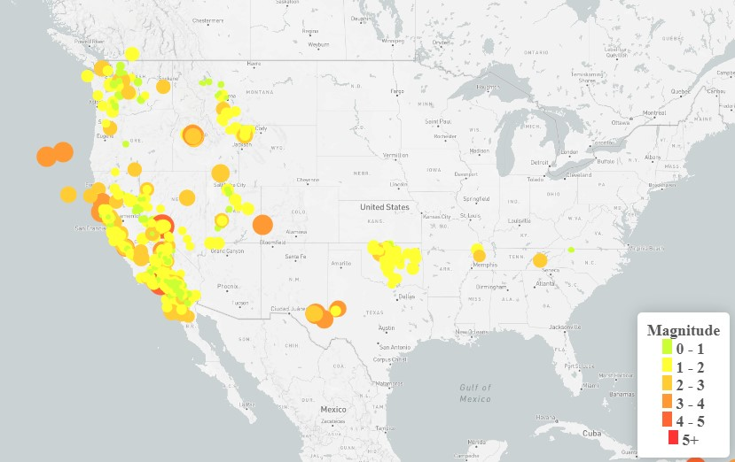

## Leaflet Homework - Visualizing Data with Leaflet

The USGS is responsible for providing scientific data about natural hazards, the health of our ecosystems and
environment; and the impacts of climate and land-use change. Their scientists develop new methods and tools to
supply timely, relevant, and useful information about the Earth and its processes.

I created several tools that allow for the visualization of their earthquake data.

In this repository there are folders **Leaflet-Step-1** and **Leaflet-Step-2**.

I utilize both html and Javascript to analyze the data.

# Leaflet-Step-1
This step visualizes an earthquake data set on a greyscale map. Leaflet is used to plot all the earthquakes in the dataset for the past 7 days based on their longitude and latitude.
The data markers reflect the magnitude of the earthquake in their size and color. Earthquakes with higher magnitudes appear larger and darker in color.
Popups are included that provide additional information about the earthquake when a marker is clicked.
A legend provides context for the map data.

